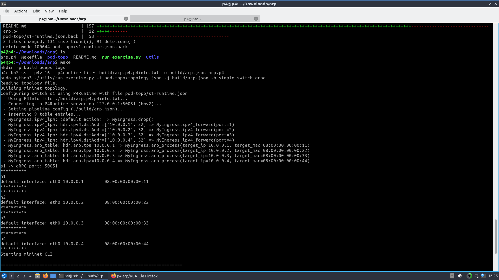
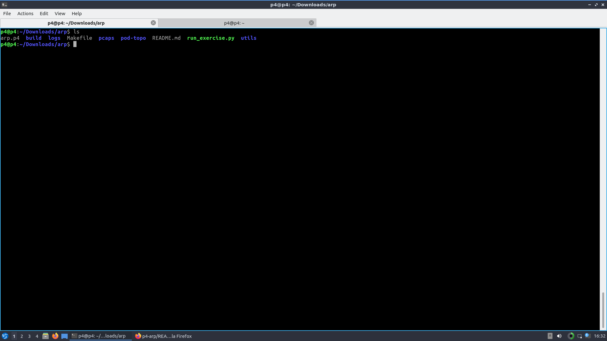
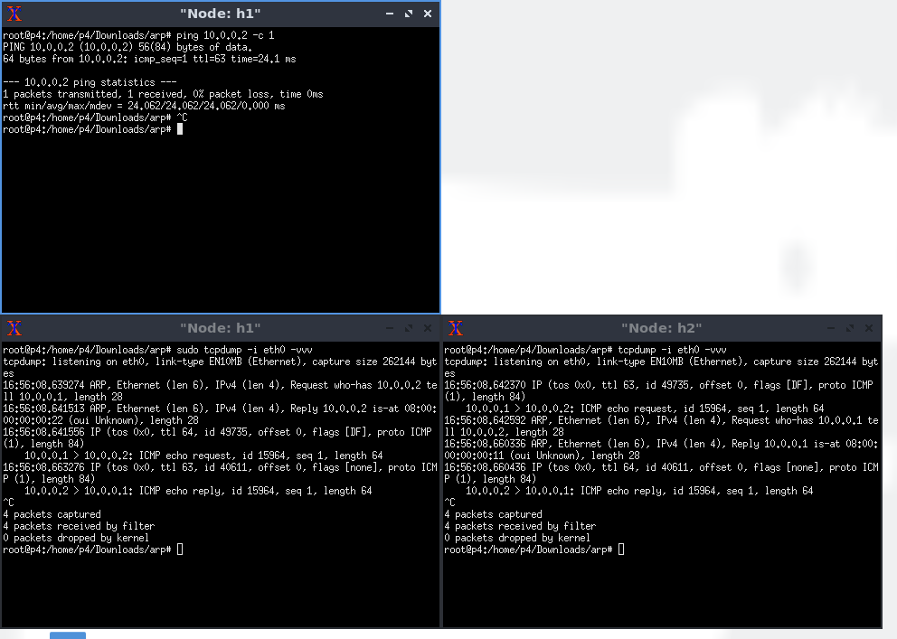
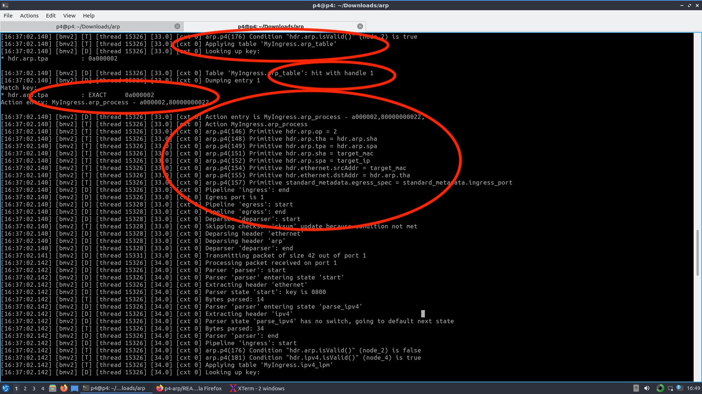
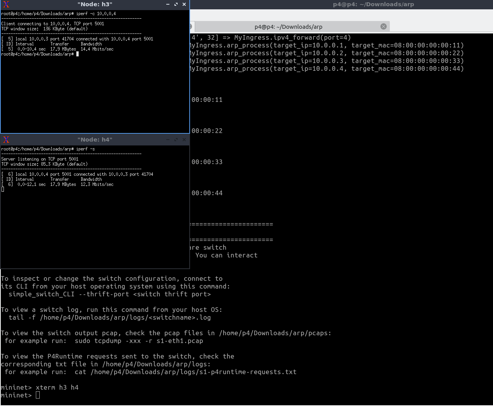

# Implementing ARP on data plane

## Introduction

The objective of this program is to interpret ARP requests on data plane. The functionality is implemented in `arp.p4` file.

> **Note:** I have used some code from p4lang repository ([tutorials/exercises/basic/](https://github.com/p4lang/tutorials/tree/master/exercises/basic)) for implementation of the topology and running the `mininet`. I have put adequate comments for the lines of code I wrote.


## Network Topology
The topology is defined in `pod-topo/topology.json`. There are 4 hosts connected to a switch. The first host is connected to `p1` of the switch, the second host to `p2`, and so on. The following table shows the IP and MAC addresses assigned to each host.

| Host            | IP Address      | MAC Address     |
| --------------  | -------------   | -------------   | 
| Host 1          | 10.0.0.1        | 08:00:00:00:00:11|
| Host 2          | 10.0.0.2        | 08:00:00:00:00:22|
| Host 3          | 10.0.0.3        | 08:00:00:00:00:33|
| Host 4          | 10.0.0.4        | 08:00:00:00:00:44|


## ARP Header

The ARP header is defined as follow in the code.
I used [this](https://forum.p4.org/t/how-define-the-arp-header-in-the-p4-program/584/3) reference for the defination and parsing.
```
header arp_t {
    bit<16> hrd; // Hardware Type
    bit<16> pro; // Protocol Type
    bit<8> hln; // Hardware Address Length
    bit<8> pln; // Protocol Address Length
    bit<16> op;  // Opcode
    macAddr_t sha; // Sender Hardware Address
    ip4Addr_t spa; // Sender Protocol Address
    macAddr_t tha; // Target Hardware Address
    ip4Addr_t tpa; // Target Protocol Address
}
```

Moreover, I put the ARP header in the global header struct, alongside ethernet and ipv4:
```
struct headers {
   ethernet_t     ethernet;
   ipv4_t         ipv4;
   arp_t          arp;
}
```

Also, after parsing ethernet header, if ``EtherType`` indicates that the received packets is an ARP request (`EtherType: 0x806`), I parse the header as follow.
```
state parse_arp {
    packet.extract(hdr.arp);
    transition accept;
}
```


# An example of ARP request and reply in traditional networks.

For example, assume `Host 1` needs `Host 2`'s MAC address. In this case the sender is `Host 1`, and the target is `Host 2`.
So, `Host 1` broadcasts an ARP requests with following values:
```
op    = 1                     // Opcode for the ARP requests
sha   = 08:00:00:00:00:11     // Host 1 knows its mac address
spa   = 10.0.0.1              // Host 1 knows its ip address
tha   = 00:00:00:00:00:00     // Host 1 is looking for this one
tpa   = 10.0.0.2              // Host 1 specifies the target's IP
```

In a traditional network, the switch broadcasts the ARP requests. So, `Host 2` receives the ARP requests sent by `Host 1`, and detects that `Host 1` is asking for its MAC. Then, `Host 2` gets back to `Host 1` by sending an ARP reply to `Host 1`. The reply's header are filled as follow:
```
op    = 2                     // Opcode for the ARP replies
sha   = 08:00:00:00:00:22     // Host 2 knows its mac address
spa   = 10.0.0.2              // Host 2 knows its ip address
tha   = 08:00:00:00:00:11     // Host 2 gets Host 1's mac 
tpa   = 10.0.0.1              // Host 2 specifies the target's IP
```

Finally, `Host 1` receives the ARP reply, and by checking `sha` in ARP header, finds `Host 2`'s MAC.


# The overview of ARP implementation
I mentioned how ARP header is defined before.

Here, I explain how the ARP works alongside routing in the switch.

First of all, there are two tables in `MyIngress`. One table for ARP handling, named `arp_table`. Another table, `ipv4_lpm`, is used for routing.

The program checks to see if ARP or IPV4 headers are valid. Then applies the correspond match+action table. 

Here, I only explain the first table. The latter table has only a simple action which transmits packets to proper PORT according to the destination address.

If the ARP header is valid, it means a host is looking for a MAC address.

If `hdr.arp.tpa` matches to an entry in `arp_table`, it means the required information is available for the host having `hdr.arp.tpa` IP address.

The action `arp_process` handles the ARP requests and set reply's header, and send the packet back to the port it came from:
```
action arp_process (ip4Addr_t target_ip, macAddr_t target_mac)
{
   // Changing opcode to reply's opcode
   hdr.arp.op = 2;

   // Setting target's IP and MAC using the received information
   hdr.arp.tha = hdr.arp.sha;
   hdr.arp.tpa = hdr.arp.spa;

   // Filling the required information using the
   // data in the table
   hdr.arp.sha = target_mac;
   hdr.arp.spa = target_ip;

   // It is not mandatory, however, it would be better
   // to swap src and dst MACs 
   hdr.ethernet.srcAddr = target_mac;
   hdr.ethernet.dstAddr = hdr.arp.tha;

   // Sending back the reply to the same port.
   standard_metadata.egress_spec =  standard_metadata.ingress_port;
}
```

# Running the code

>**Note:** As I mentioned before, I am using some utility code from P4lang repo.

To run the code, navigate to project and run
```bash
make
```

It will lunch Mininet automatically.




The above picture shows that 4 entries are added into the arp_table.
For instance, if `hdr.arp.tpa=10.0.0.1`, the action `arp_process` is called, and the required fields are passed to it for processing. 

The entries for the tables in the data plane are provided in `pod-topo/s1-runtime.json`. 


Also, the script creates two directories, "build" and "logs". We can check the switch logs by
```bash
tail -f ./logs/s1.log
```



# Running the first example
I opened two terminal assigned to `Host 1`'s netspace and one terminal assigned to `Host 2`'s by running the following line in Mininet.
```
xterm h1 h1 h2
```

In one terminal of `Host 1`, I ran `tcpdump` (the bottom-left terminal in the picture):
```bash
tcpdump -i eth0 -vvv
```

Using the same command, I ran `tcpdump` on `Host 2` (the bottom-right terminal in the picture):


In the another terminal of `Host 1`, I sent 1 ping to `Host 2`:
```bash
ping 10.0.0.2 -c 1
```



The `tcpdump` on  bottom-left shows that an ARP request is sent asking who has 10.0.0.2 MAC address. After that, the appropriate reply is captured. Next, the ICMP request/reply are sent. It shows that ARP managed somewhere. 

But, `Host 1`s request is not received in bottom-right terminal. 

(Another ARP request is captured in the other terminal asking for 10.0.0.1. That happens when `Host 2` wants to get back to ping and needs `Host 1`'s MAC!)

**So, where the request is handled?**

The picture below shows the the switch does the operations for handling arp.




# Running the second example

For the second example, I check the connectivity of `Host 3` and `Host 4` by a simple `iperf` test.




# Contact

Feel free to contact me if you need more information